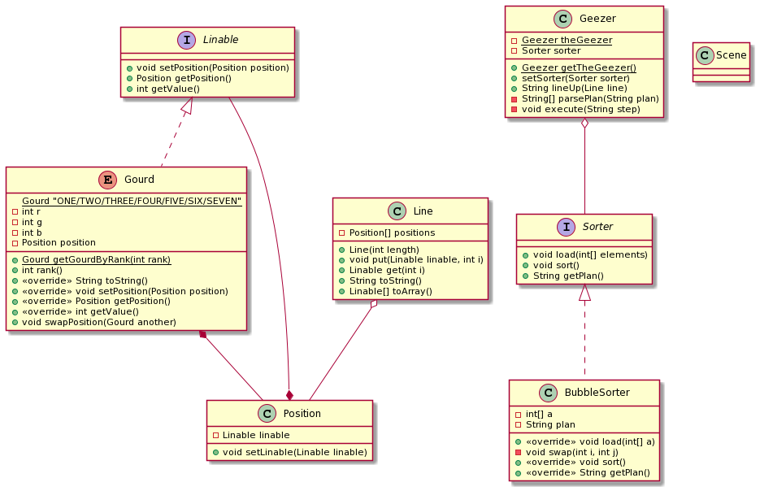

## Java - 第二次作业

#### 191220080 马英硕

## 任务一

example 的类图如下：

Scene 中 main 方法执行过程中的对象时序图如下：

#### 如何理解 example 的设计呢？

先来讲讲总体设计思路，以及它的好处。

我们可以看出，Linable 是一种接口，Gourd 是一种 Linable 的实现，但多了颜色值和 rank。

Line 是总体用来排序的一个容器类，它用一堆 Position 去包装一堆 Linable。

* Position 是 Linable 的一种包装，它在 Line 中作为 Linable 的包装使用。而每个 Linable 也记录自己对应哪个 Position；

Gourd 提供了与另外一个 Gourd 实例进行交换的函数 `swapPosition`。观察它的实现，可见只交换了 Gourd 内部存的 Position，而且交换前后 Gourd 和其内部的 Position 仍然保持一一对应关系。

* 也就是说，rank 和 颜色值 在 Gourd 层面施行交换前后并不会有任何改变。

Sorter 是 theGeezer 用于排序的工具，同样也是一种接口。它接收一系列的 rank (这是每个元素的键值)，并且执行排序。BubbleSorter 是一种 Sorter 的实现，是一种特定的排序算法。

老头 theGeezer 只需要左手拿着排序器，右手拿着一系列 Gourd 构成的 Line，就可以执行排序。

好处自然是很多，比如：

* 老头儿的实例采取了单例实现，是全局唯一的；
* 排序算法可以自由选择而不用更改任何使用排序的对象的代码，实现了使用和设计的分离；
* 排序算法实现了初步排序 log 包装，可以实现 log 记录与分析；
* 可以构造其他种类的 Linable，老头 theGeezer 同样能够使用排序算法对它进行排序，同理 Line 和 Position 也能包装它；
* 实际上排序算法和 Linable 并没有什么联系。老头排序时使用的方式是拿到他所有目前顺序的 Linable 内的 value (这里就是 Gourd 的 rank)，然后拿去给排序算法排序。这实现了被排序对象的管理和排序算法分离，操作起来比较灵活；
* 重写了 Gourd 的 toString 方法，可以灵活输出一个 Gourd 对象 (目前这里就是多输出颜色值)；
* Position 对 Linable 的包装可以让 Linable 的实现者实现对 Position 数组在不交换其下标的前提下互换其中的内容，实现了可以快速从值和下标位置两个角度去获取对应元素。

可改进之处：

* Gourd 的设计采取“硬编码”方式，利用 enum 提供的下标去获取 rank，多少有些不灵活；
* 一些类内的函数、成员等排列有些散乱，但问题不大；
* 貌似综合 Gourd、老爷爷和 BubbleSorter，解析排序算法 log 的方式全是 Swap-based。这是不是一定程度限制了我们排序算法、数据管理的实现？
* log 处 采取了直接进行 String 相加的方式，这是一种巨大的开销，因为 log 很长！
  * 每次相加都会把之前的字符串复制一遍，简直就是简直了，导致运行时非常慢；
  * 暂不考虑缓冲输出方式，因为 log 也确实没那么长，但采取 StringBuffer 会更好一点吧？

## 任务二

这里我将 Gourd 更改为一个普通的类，并且 256 个小妖怪的颜色采取完全随机的生成方式 (但会避免重复)，并为其赋值 rank，以适应排序算法的需要。

根据任务一中总结的可改进之处，我这里还将解析排序的方式从 Swap-based 变成了真正的 Step-based。

* 对于大部分排序算法而言，实际上 Swap 和 Step 是等价的；
  * 但对于快速排序的某种实现方式中，我们可以不进行 Swap-based 而是 Copy-based 的 Partition，此时我们解析的方式便限制了快速排序的实现必须采取 Swap-based 方式而非 Copy-based；
  * 桶排序、基数排序、计数排序等，它们全都不是 Swap-based。我们实际上无法仅仅在 example 提供的解析基础上实现这些排序算法。
* 由于 Swap-based 还是太常用了，而且是表示排序过程中一个步骤的很好很简洁的方式，我决定保留它；
* 我的解决方案是，**扩展** Swap-based 为 Step-based。这样又保留了 Swap-based 排序算法环境下的**高效性**，又有很好的**向下兼容性**；同时，也**支持**了那些非 Swap-based 的排序方法。
  * 一个 Step 被我定义为：之前的序列->现在的序列；
  * 现在的一个 Step 可能会有很多的操作，比如它可能不止止进行了一个交换操作。原来的一个 Step 就是一个 Swap，现在的一个 Step 很可能是一个快速排序的 Partition，也可能是基数排序的一次扫描；
  * 用这种 Step 定义处理 Swap-based 排序时，处理效率一定是不如之前的。因为原来只需要表示哪两个元素进行了交换，现在则需要加上很多冗余信息，包括所有未改动的元素，因为要提供整个序列；
  * 我们要求排序算法设定自己是不是 Swap-based，这样我们便可以对非 Swap-based 算法进行 Step-parse。
* 此外，既然接口 Sorter 提供了 getPlan 方法，那么不如我们去**实现一个 PlanParser 提供解析服务**。

#### OK，啰啰嗦嗦这么多，除了 Task2 要求以外，我要干这么两件事：

1. 扩展 Swap-based Sorting 为 Swap & Step-based Sorting；
2. 实现 PlanParser 对 log 的解析。

#### 完成 Task2 的方式是：

1. 将 Gourd 更改为 LittleDevil 类，并取消枚举特性，采取不重复随机生成法，重定义 rank 为颜色值；
2. 将 Geezer 更改为 Snake 类，保留大部分功能，但解析 plan 的功能交给 PlanParser；
3. 除了 BubbleSorter，实现另外三种排序算法。因为 Swap-based 步骤太多太折磨，所以我会实现：
   * Swap-based 的快速排序算法 (每一个 Step 是一次 Partition 后的结果)；
   * 非 Swap-based 的快速排序算法 (每一个 Step 是一次 Partition 后的结果)；
   * 基数排序 (LSD，最低位优先，第一个 Step 是个位数排序后结果，以此类推，256个小妖精应该最多只有 8 个 Step，因为我的颜色值最大为 16777215)；
4. 快速初始化所有小妖精随机排列；
5. 在记录 log 处采用 StringBuffer。

因为256个实在是绝了，所以只能用64个了。

不知道为什么采用 64 个数字时控制台会显得比较暗，数字较少或 256 个时没有这个问题。

BubbleSorter 可视化链接：https://asciinema.org/a/0HLD6AYayY3cjrMWyF82yxLKI

Swap-based 快速排序可视化链接：https://asciinema.org/a/qDiCeNMfYDuAY7wZUw8CDQOMD

非 Swap-based 快速排序可视化链接：https://asciinema.org/a/PSd6ZPSEv2aFI0jprqi9r9pid

基数排序可视化链接：https://asciinema.org/a/Jo7VaKdw9CUuqvzjYF6WjgBbO

类图：

### 我的天呐，为了实现这些功能真的花上了好长好长好长好长时间，各种debug，不过挺有意思的，java 很多包装类的使用方式确实不熟悉

## 任务三

只需要在合适的地方换行就行了吧...？

Line.java 是我唯一更改的地方：

BubbleSorter 可视化链接：https://asciinema.org/a/oMSsqpc1UAVQ2ld0LflDNF2wd

Swap-based 快速排序可视化链接：https://asciinema.org/a/YTvyxxzCSpnkYjtU38lRuhdou

非 Swap-based 快速排序可视化链接：https://asciinema.org/a/GVIXxJDfD2vouok9MRxg3Iawk

基数排序可视化链接：https://asciinema.org/a/3vKZiOpDRTcbYzcTnpSNoprue

类图自然也同上。